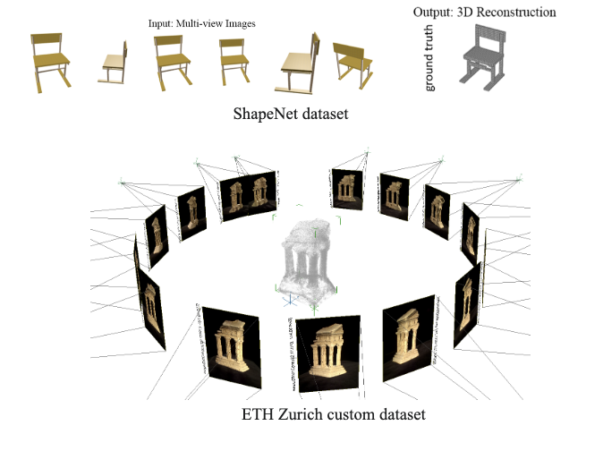
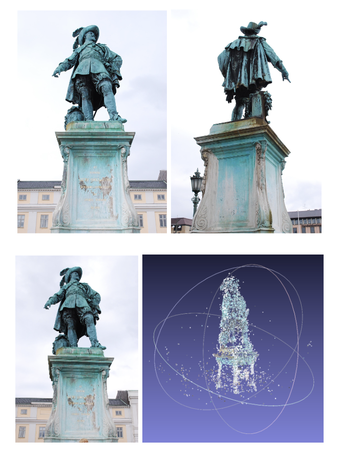
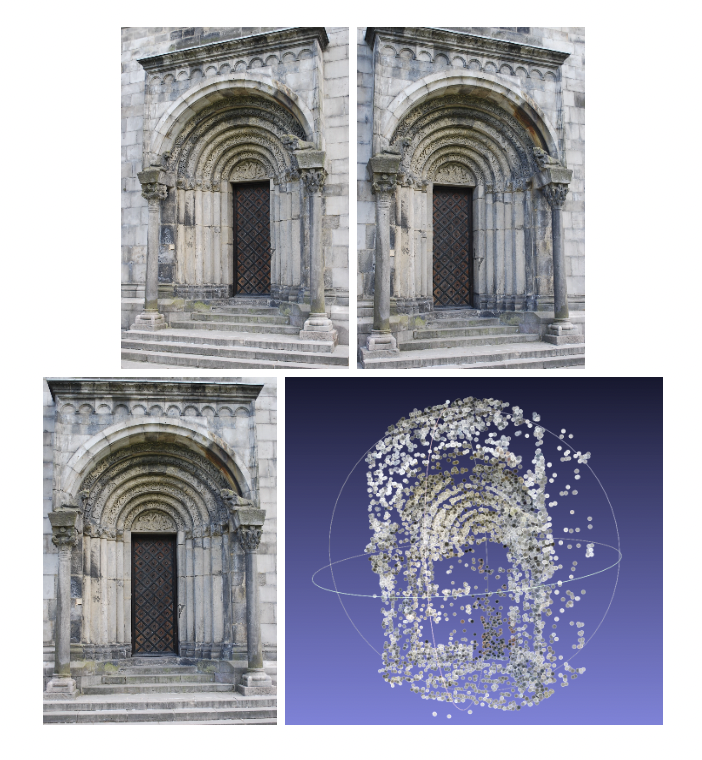
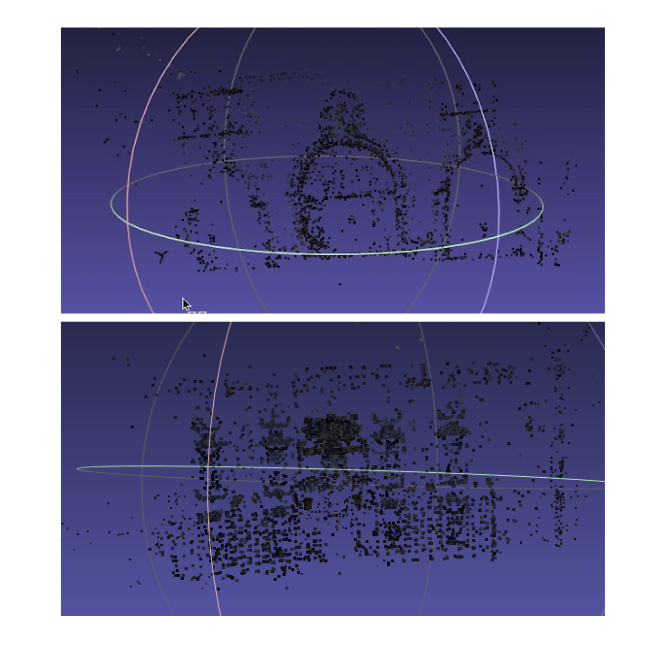

# Multiview-3D-Reconstruction

The demo of the project: https://www.youtube.com/watch?v=zkdbnCG7ACQ

# Introduction

<p align="center">
  
</p>

One of the main difficulties in image-based modeling and computer vision is creating a 3D model from 2D images that is as realistic as possible. The development of three-dimensional models from a group of photos is known as 3D reconstruction from multiple photographs. Recent and rapid advances in the domains of autonomous driving and augmented reality, which rely significantly on precise 3D reconstructions of the surrounding world, are approximated by combining depth readings from sensors such as LIDAR, structured light, and other specific sensors. The disadvantage of these sensors is that they require special hardware, which makes them more effective but also more complicated to acquire and use than systems that rely solely on RGB camera systems. Additionally, due to the low albedo and glossy, reflective, or obstructive surfaces, the sensors suffer from noise and missing measurements.

The current advancements in digital cameras, as well as an improvement in picture resolution and clarity, have opened up new approaches to rebuild 3D images utilizing various techniques that employ merely these cameras rather than pricey special sensors, making the reconstruction process relatively affordable. The goal of the reconstruction is to derive the geometrical structure of a scene from a set of photos, assuming that the camera position and internal parameters are known or can be guessed from the set of images. This is accomplished by employing numerous photos in which the 3D information may be (partially) retrieved by applying the Structure from Motion approach to solve the pixel-wise correspondence problem.

The process of reconstructing a three-dimensional structure using projections acquired from a succession of photographs from diverse viewpoints is known as Structure from Motion (SfM). This technique produces advanced state-of-the-art findings, but the technique's primary concerns are resilience, precision, completeness, and scalability, which are handled using an incremental approach for the structure from motion. LIDAR-based 3D reconstruction of a scene is costly and prone to artifacts from GPS and IMU. Structure from Motion method uses just low-cost camera images to rebuild a 3D scene while also obtaining the camera poses of the monocular camera in relation to the provided scene.

# Methodology

The basic idea in 3D image reconstruction is that given a set of images {I<sub>1</sub>, ..., I<sub>N</sub>} where each image is taken from a different viewpoint, our goal is to use these images to reconstruct a three dimensional representation of the object. More specifically, we will find the motions of the cameras with respect to a world coordinate frame F<sub>W</sub>. This motion of cameras is also known as camera projection matrices {P<sub>1</sub>, ... P<sub>N</sub>}. Using this set of camera projections we will then use different algorithms to recover the 3D structures of the scene. 

To perform this, we will construct a pipeline that will consist of two main parts, data association, structure-from-motion (SfM). Data association is used to check whether a pair of images are similar to each other. Two images can be checked for similarity by using image correspondences and robust two-view geometry. Structure-from-motion is responsible for the initial reconstruction using pose estimation and triangulation techniques and refining this using the bundle adjustment algorithm. MVS is then applied on this to get a dense 3D representation.

Data association is the first part of the 3D reconstruction pipeline. Given a set of unstructured images, we first find the connected components in these images. This helps us to find overlapping views in images. To establish the connected components, we use the SIFT [3] algorithm that helps us to extract keypoints from the images. We then perform image or keypoints correspondences using a two-view geometry algorithm. This will map a feature in one image to a similar feature in another image. One of the problems in data associations is that in set of input images N is large, then searching through image pairs becomes intractable and the complexity of querying one image is of the order O(N.K^2) where K is the number of keypoints in each image. An efficient tree based method is used for image retrieval. This makes the complexity of querying an image reduce to O(K.b.L) where K is the features in the  query image, b is the branches in the tree and l is the levels in the tree.

There are three different methods in SfM namely, incremental SfM, global SfM and hierarchical SfM. For our purpose, we used the incremental SfM for generating the sparse 3D reconstruction. The basic idea of incremental SfM is as follows. First we choose two non-panoramic views from the scene graph generated by the data association step. A 8-point algorithm is used to compute the fundamental or the essential matrix. The fundamental matrix can also be thought of as a camera projection which can be decomposed into two matrices P and P'. P' represents the intrinsic camera calibration. We then apply the linear triangulation algorithm 

# Setup and Usage

1. Install the Python requirements

```bash
pip3 install opencv-contrib-python
pip3 install scipy
pip3 install tomlkit
pip3 install tqdm
```

Datasets are present in the [Datasets](Datasets) directory

2. Create an Sfm object sfm_1 with path to <img_dir> as an argument. <img_dir> has to have a file called `K.txt` containing the camera intrinsic parameters.

3. Call the object sfm_1 with optional parameter enable_bundle_adjustment (Takes a long time set to False for quick run). An example is provided in the sfm.py main function.

4. Run the sfm.py file
```bash
python3 sfm.py
```
5. Open the .ply file using Meshlab present in [res](res) directory.

To view the model a software like [Meshlab](https://www.meshlab.net/#download) is required.

A few runs are present in the [res](res) directory as well.

# Results

For testing our models we used several images of different objects. The dataset for an object will consist of several images of the object taken from different positions and angles. Along with the images, the camera calibration matrix K must be provided. This encodes the information required for obtaining the projection matrix for each image. 

<p align="center">
  
</p>
<p align="center"> Figure 1: Shows sample input images of Gustav II Adolf statue and the corresponding 3D reconstruction at the bottom right (Bundle Adjustment was not applied to this reconstruction).  </p>

<p align="center">
  
</p>
<p align="center"> Figure 2: Shows images of a door and the corresponding 3D reconstruction of the door on the bottom right.
</p>

<p align="center">
  
</p>
<p align="center"> Figure 3: Shows image reconstructed using Bundle adjustment on the left, without Bundle Adjustment on the right.
</p>

In our experiments, the Bundle Adjustment algorithm takes a very long time on large images. Hence we were able to only use it for smaller image datasets. We can obtain relatively decent 3D representation without applying bundle adjustment. However, applying bundle adjustment leads to better reconstruction quality. 

# Future Work

This work presents an implementation of the incremental SFM algorithm using linear triangulation, Perspective-n-Points algorithms to find the pose and reconstruct the image as a 3D sparse model. Additionally bundle adjustment was implemented to enhance the quality of the model. The quality of models generated with bundle adjustment is excellent. Sparse representation of structure from motion lacks any definitive quantitative metrics to compare different models. This model has some disadvantages like the images should be passed to the model in some order meaning the overlap of two images must be present to some extent. Any changes in order will break the model. Although sparse representation is a very important step in generating 3D models from 2D images, dense image reconstruction is required for all practical usage. This dense image can be generated using the Multi-View Stereo (MVS) algorithm. So the next step is to improve the current model and implemet MVS and get a more denser accurate 3D representations of the 2D images.

# LICENSE
MIT


